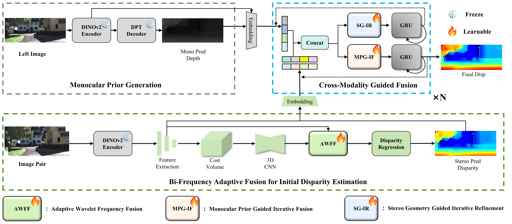

# 🚀 MAFNet++🚀 : Integrating Monocular Priors into Multi-Frequency Adaptive Fusion for Stereo Matching
Stereo matching constitutes a fundamental technique for precise three-dimensional scene perception. Current stereo approaches depend on epipolar geometry to build disparity cost volumes for absolute depth estimation, but they tend to break down in complex scenarios characterized by weak textures, unstructured surfaces, or severe illumination variations. Monocular depth estimation regresses continuous relative depth through global prediction and exhibits stronger semantic and contextual modeling capabilities, yet its modality gap makes it difficult to integrate effectively with stereo geometric features. To tackle these challenges, this paper proposes MAFNet++, a multi-frequency adaptive fusion network that incorporates monocular priors. The network integrates features across high- and low-frequency domains via the Adaptive Wavelet Frequency Fusion (AWFF) module, producing an initial disparity map. Subsequently, a dual-direction iterative process, composed of Monocular Prior Guided Iterative Fusion (MPG-IF) and Stereo Geometry Guided Iterative Refinement (SG-IR), facilitates dynamic interplay between monocular structural priors and stereo geometric information. The former introduces monocular priors to mitigate stereo ambiguity in reflective and low-texture areas, whereas the latter refines monocular depth by enforcing geometric constraints. Experimental results show that MAFNet++ attains state-of-the-art accuracy across several benchmark datasets and off-Earth imagery, with exceptional robustness in extreme lighting and planetary environments.

